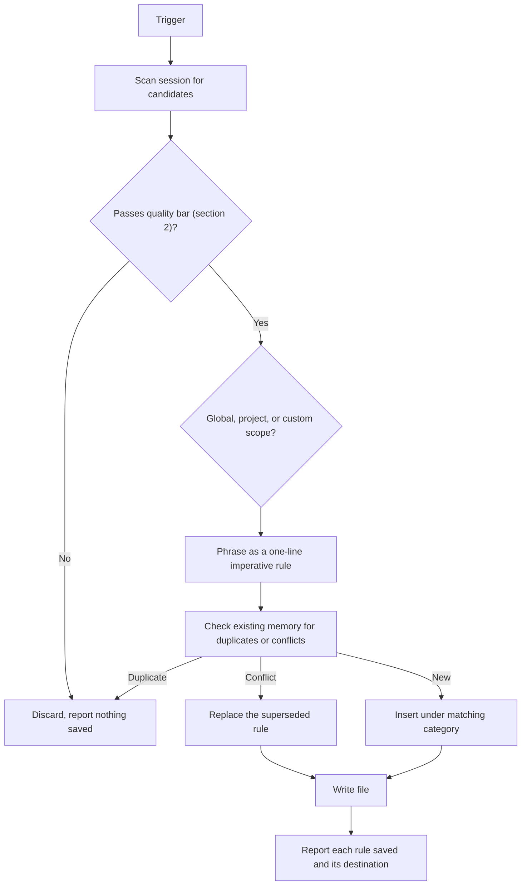

# Learn Skill: Agent Memory & Continuous Learning

Extract knowledge worth keeping from a session and write it into persistent memory so future sessions start smarter. Framework-agnostic: works in any harness that reads `AGENTS.md` or a configured rules file.

---

## 1. When to run

- The user explicitly asks: `/learn`, "remember this", "save this rule".
- The user corrects the agent, or repeats a preference they have stated before.
- A non-obvious configuration, architecture decision, or debugging fix was resolved and would cost real time to rediscover.
- A session is wrapping up and should be reviewed for anything durable.

If nothing clears the quality bar in section 2, say so and write nothing. An empty result is a valid outcome and is better than diluting memory with noise.

---

## 2. Is it worth learning?

Save a candidate only if **all four** are true:

1. **Durable** - still true next week, and next session. Not tied to the current task, branch, or ticket.
2. **Actionable** - changes what an agent would do. A rule that no future action depends on is trivia.
3. **Recurring** - the situation will plausibly come up again.
4. **Non-obvious** - a competent agent would not already infer it from the code, the docs, or common practice.

**Never save:**
- Secrets: API keys, tokens, passwords, connection strings, private URLs.
- Personal identifiers or anything the user would not want written to a file that may be committed.
- Transcript excerpts, task status, or session narration. Memory holds rules, not history.
- Facts already discoverable in the repo (dependency versions, file locations, existing config).

**Do not save:**
- One-off instructions scoped to the current request ("skip tests just this once").
- Speculation about preferences the user never actually stated.
- Restatements of a rule already in memory.

When a candidate is borderline, ask the user before writing.

### Examples

| Candidate | Verdict |
| :--- | :--- |
| "Never edit files under `vendor/`; they are generated by `make vendor`." | Save - durable, actionable, non-obvious |
| "Use HSL rather than hex for all CSS color values." | Save - a stated, durable preference |
| "On this codebase, `pytest` must run via `uv run pytest` or imports fail." | Save - non-obvious, saves real time |
| "The user is refactoring `auth.py` today." | Skip - task status, not durable |
| "The project uses TypeScript." | Skip - discoverable from the repo |
| "Write clean, readable code." | Skip - vague, not actionable |

---

## 3. Memory scopes

| Scope | Default destination | Holds |
| :--- | :--- | :--- |
| **Project** | `AGENTS.md` at repo root | Repo architecture, tech-stack standards, build and test invocations, directory conventions |
| **Global** | `~/.agents/rules.md` | User-wide preferences, coding style, cross-project directives |
| **Custom** | User-specified path | Any harness with its own memory location |

`AGENTS.md` is the project default because it is the cross-harness convention read by Cursor, Codex, Gemini CLI, and others. There is no equivalent standard for global memory, so `~/.agents/rules.md` is a neutral default; see [references/architecture.md](references/architecture.md) for native per-harness global locations if you want automatic loading.

Learned rules go under a single `## Learned Rules` section so they stay separate from hand-written instructions in the same file. Never rewrite or reorder content outside that section.

Precedence: an explicit instruction in the current turn beats project memory, which beats global memory.

---

## 4. Rule format

One rule per bullet, imperative voice, one line. Add a short rationale in parentheses only when the reason is not self-evident.

```markdown
## Learned Rules

### Styling
- Use HSL rather than hex for CSS color values (keeps the theme tokens interpolatable).

### Build & Test
- Run pytest via `uv run pytest`; a bare `pytest` resolves the wrong interpreter.
```

Good and bad phrasing:

- Good: `Never edit files under vendor/; regenerate them with make vendor.`
- Bad: `Be careful with the vendor directory.` (not actionable)
- Good: `Prefer composition over inheritance in the services layer.`
- Bad: `The user said in this session that they like composition sometimes.` (narration, hedged)

Keep the file small. It is injected into context every session, so every line costs tokens in every future conversation.

---

## 5. Workflow



**Step 1 - Scan.** Review the session for explicit constraints, corrections, and hard-won fixes.

**Step 2 - Filter.** Apply section 2. Discard anything that fails.

**Step 3 - Phrase and scope.** Write each survivor in the section 4 format and pick project, global, or custom.

**Step 4 - Reconcile.** Read the target file first. Skip exact duplicates. If a new rule contradicts an existing one, replace the old line rather than appending a second, conflicting rule. If several existing rules overlap with the new one, consolidate them into one entry.

**Step 5 - Write.** Use the helper script or edit the file directly:

```bash
python scripts/memory_manager.py --action append --scope project --category "Build & Test" --content "Run pytest via 'uv run pytest'; a bare pytest resolves the wrong interpreter."
```

The script appends one single-line rule under `## Learned Rules` -> `### <category>`, creating either heading if absent, and skips exact duplicates. It will not touch anything outside the `## Learned Rules` section. For rewriting or removing an existing rule, edit the file directly.

**Step 6 - Report.** Tell the user exactly which rules were saved and to which file. If nothing was saved, say that.

---

## 6. Extraction prompt

For running extraction through a subagent or a separate model call:

```text
You are a memory extraction engine for an AI coding agent. Read the transcript and
extract only knowledge worth persisting for future sessions.

Save a candidate only if ALL are true: it is durable (still true next session),
actionable (changes what an agent would do), recurring (will come up again), and
non-obvious (not inferable from the repo or common practice).

Never output: secrets or credentials, personal identifiers, transcript excerpts,
task status, facts discoverable in the repo, or restatements of existing memory.

For each rule that qualifies, output one line:
  SCOPE | CATEGORY | RULE

SCOPE is GLOBAL (user preference across projects) or PROJECT (this codebase, including
operational procedures for this repo). CATEGORY is a short heading such as Styling or
Build & Test. RULE is one imperative sentence, with a parenthetical rationale only if
the reason is not obvious.

If nothing qualifies, output exactly: NONE

TRANSCRIPT:
{{TRANSCRIPT_TEXT}}

EXISTING MEMORY:
{{EXISTING_MEMORY_TEXT}}
```

---

## 7. References

- [scripts/memory_manager.py](scripts/memory_manager.py) - read and append memory files from the CLI.
- [references/architecture.md](references/architecture.md) - scope hierarchy, precedence, per-harness memory locations.
- [references/integration_guide.md](references/integration_guide.md) - wiring the skill into a custom agent harness.
