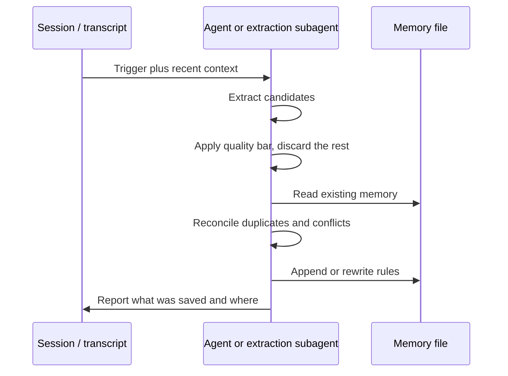

# Agent Memory Architecture

Scope hierarchy, precedence, per-harness memory locations, and the division of labor between the agent and the helper script. Read this when integrating the Learn Skill somewhere new or deciding where a rule belongs.

---

## 1. Scopes and precedence

```
Global memory      ~/.agents/rules.md (configurable)
                   User-wide preferences, cross-project directives
        |
        v
Project memory     <repo root>/AGENTS.md
                   Repo architecture, stack standards, build and test invocations
        |
        v
Skill memory       <skill dir>/SKILL.md
                   Procedural knowledge for one workflow
```

1. An explicit instruction in the current turn overrides all persistent memory.
2. Project memory overrides global memory where the two conflict on a project-specific matter.
3. Skill memory supplies procedure and never overrides a user constraint from either scope.

Route a rule to global scope only if it holds across unrelated repositories. Anything tied to one codebase belongs in project memory, even when it reads like a personal preference.

---

## 2. Where memory files live

`AGENTS.md` at the repository root is the project default: it is a cross-harness convention read automatically by Cursor, Codex, Gemini CLI, and others, so one file serves every tool.

No equivalent standard exists for global memory. The script defaults to `~/.agents/rules.md`, which nothing loads automatically. To have global rules loaded without configuration, point `--file` at the harness's native location:

| Harness | Global memory location |
| :--- | :--- |
| Cursor | `~/.cursor/rules/` (one `.mdc` file per rule set) |
| Claude Code | `~/.claude/CLAUDE.md` |
| Codex | `~/.codex/AGENTS.md` |
| Gemini CLI | `~/.gemini/GEMINI.md` |
| Custom harness | Whatever the harness loads; pass it via `--file` |

---

## 3. File layout

Learned rules occupy a single `## Learned Rules` section, subdivided by category. Everything outside that section is hand-written and must not be reordered or rewritten by the skill.

```markdown
# Project Name

Hand-written project instructions live here and are never touched.

## Learned Rules

### Build & Test
- Run pytest via `uv run pytest`; a bare pytest resolves the wrong interpreter.

### Styling
- Use HSL rather than hex for CSS color values.
```

One rule per bullet, imperative voice, single line, optional parenthetical rationale. The rule text is the identity of the rule, so keep phrasing stable when editing.

---

## 4. Pipeline



---

## 5. Division of labor

The script is deliberately small. It guarantees exactly three things:

- Resolves the target path from scope, workspace, or an explicit `--file`.
- Appends a single-line rule under the correct `## Learned Rules` -> `### <category>` headings, creating either heading when absent.
- Skips an append when a normalized-identical bullet already exists anywhere in the file.

Everything else is the agent's judgment, not automation:

| Concern | Handled by |
| :--- | :--- |
| Deciding a candidate is worth saving | Agent, via the quality bar in `SKILL.md` |
| Near-duplicate and paraphrase detection | Agent, by reading the file before writing |
| Replacing a superseded rule | Agent, by editing the file directly |
| Consolidating several overlapping rules | Agent, by editing the file directly |
| Concurrent writes from parallel agents | Not handled; serialize memory writes in the harness |
| Change history | Not handled; use version control on the memory file |

The script has no locking and no audit log. If a harness runs subagents that may write memory simultaneously, funnel their writes through a single point.

---

## 6. Safety

1. Never persist API keys, tokens, passwords, connection strings, or personal identifiers. Memory files are frequently committed to version control.
2. Never persist transcript excerpts or task status. Memory holds rules, not history.
3. Treat memory files as code: review the diff before committing.
