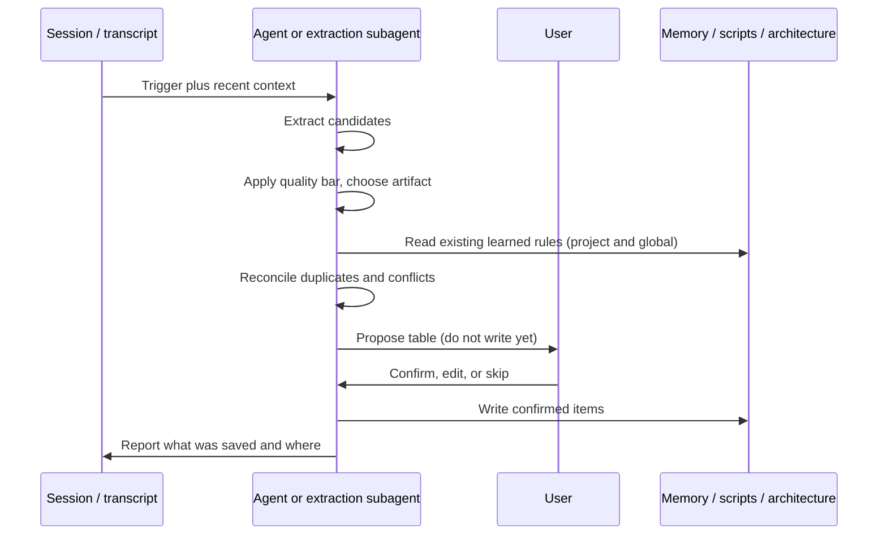

# Agent Memory Architecture

Scope hierarchy, precedence, per-harness memory locations, and the division of labor between the agent and the helper script.

---

## 1. Scopes and precedence

```
Global memory      harness-native file (see section 2)
                   User-wide preferences, cross-project directives
        |
        v
Project memory     <git root>/AGENTS.md
                   Repo conventions, build/test invocations, pointers to scripts
        |
        v
On-demand notes    architecture.md / docs/architecture.md
                   Structural maps; not injected every turn
        |
        v
Skill memory       <skill dir>/SKILL.md
                   Procedural knowledge for this workflow
```

1. An explicit instruction in the current turn overrides all persistent memory.
2. Project memory overrides global memory where the two conflict on a project-specific matter.
3. Architecture notes and scripts are read when relevant; they do not override a user constraint.
4. Skill memory supplies procedure and never overrides a user constraint from either scope.

Route a rule to global scope only if it holds across unrelated repositories. Anything tied to one codebase belongs in project memory, even when it reads like a personal preference.

---

## 2. Where memory files live

`AGENTS.md` at the git root is the project default. Cursor, Codex, Gemini CLI, and others read it. Nested `AGENTS.md` files (package-level) are only written when `--workspace` points at that directory.

Global memory must be a file the current harness loads. Pass `--harness`:

| `--harness` | Global memory location |
| :--- | :--- |
| `cursor` | `~/.cursor/rules/learned.mdc` (`alwaysApply: true` frontmatter is added on first create) |
| `claude` | `~/.claude/CLAUDE.md` |
| `codex` | `~/.codex/AGENTS.md` |
| `gemini` | `~/.gemini/GEMINI.md` |
| `neutral` | `~/.agents/rules.md` (nothing loads this automatically) |

If `--harness` is omitted, the script uses `LEARN_SKILL_HARNESS` or the first existing config dir among Cursor, Claude, Codex, Gemini, else `neutral`.

`--file` overrides both scope and harness.

---

## 3. File layout

Learned rules occupy a single `## Learned Rules` section, subdivided by category. Everything outside that section is hand-written and must not be reordered or rewritten by the skill.

```markdown
# Project Name

Hand-written project instructions live here and are never touched.

## Learned Rules

### Build & Test
- Run pytest via `uv run pytest`; a bare pytest resolves the wrong interpreter.

### Styling
- Use HSL rather than hex for CSS color values.
```

One rule per bullet, imperative voice, single line, optional parenthetical rationale. The rule text is the identity of the rule, so keep phrasing stable when editing.

Preferred categories: Architecture, Build & Test, Conventions, Editor, Git, Security, Styling, Testing, Tooling, General.

---

## 4. Pipeline



---

## 5. Division of labor

The script guarantees:

- Resolves the target path from scope, git root, harness, or `--file`.
- Lists, appends, replaces, or removes a single-line rule under `## Learned Rules` -> `### <category>`.
- Skips an append when a normalized-identical bullet already exists anywhere in the file.
- Adds Cursor `.mdc` frontmatter when creating `learned.mdc` from scratch.

Everything else is the agent's judgment:

| Concern | Handled by |
| :--- | :--- |
| Deciding a candidate is worth saving | Agent, via the quality bar in `SKILL.md` |
| Choosing rule vs script vs architecture note | Agent, via `references/artifacts.md` |
| Proposing before writing | Agent (unless the user said to save immediately) |
| Near-duplicate and paraphrase detection | Agent, by listing memory before proposing |
| Replacing a superseded rule | Agent, via `--action replace` |
| Consolidating overlapping rules | Agent, via replace/remove |
| Writing scripts or architecture notes | Agent, by editing those files directly |
| Concurrent writes from parallel agents | Not handled; serialize memory writes in the harness |
| Change history | Not handled; use version control on the memory file |

The script has no locking and no audit log. If a harness runs subagents that may write memory simultaneously, funnel their writes through a single point.

---

## 6. Safety

1. Never persist API keys, tokens, passwords, connection strings, or personal identifiers. Memory files are frequently committed to version control.
2. Never persist transcript excerpts or task status. Memory holds rules and maps, not history.
3. Treat memory files as code: review the proposal (and the diff) before accepting.
